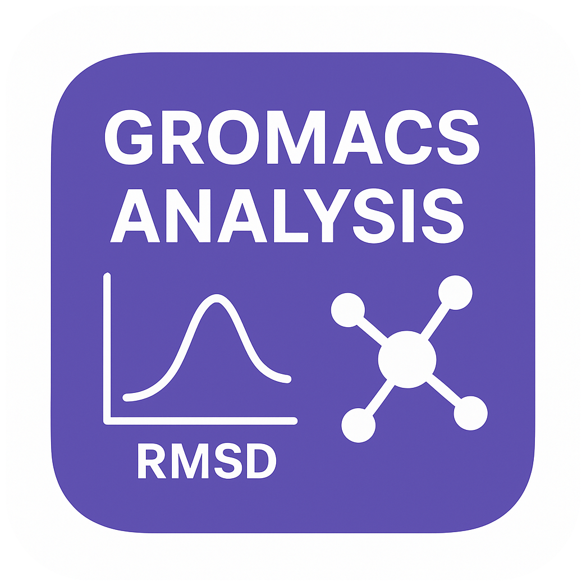

<p align="center">
  
</p>

# Gromacs-Analysis

[](https://github.com/Arifmaulanaazis/Gromacs-Analysis/releases)  
[](https://github.com/Arifmaulanaazis/Gromacs-Analysis/stargazers)  
[](https://github.com/Arifmaulanaazis/Gromacs-Analysis/network)  
[](LICENSE)  
[](https://www.python.org/)  

_A desktop application for comprehensive analysis and high-quality visualization of GROMACS molecular dynamics simulation results on Windows._

---

## Table of Contents

1. [Overview](#overview)  
2. [Features](#features)  
3. [Prerequisites](#prerequisites)  
4. [Dependencies](#dependencies)  
5. [Installation](#installation)  
6. [Usage](#usage)  
7. [Configuration](#configuration)  
8. [Project Structure](#project-structure)  
9. [Architecture](#architecture)  
10. [License](#license)  
11. [Author](#author)  

---

## Overview

**Gromacs-Analysis** provides an intuitive PyQt5-based GUI to automate common GROMACS analyses (RMSD, radius of gyration, hydrogen bonds, SASA, RMSF, protein–ligand RMSD, etc.), parse the resulting data files, and render publication-quality plots with customizable styling.

---

## Features

- **One-Click Workflow**  
  Automate the execution of GROMACS commands and data extraction into `.xvg` files.

- **Interactive Visualization**  
  Select analysis types, toggle individual samples, and apply custom line styles and markers on the fly.

- **High-Resolution Export**  
  Save plots as IMAGE PNG.

- **Multi-Sample Comparison**  
  Analyse and compare multiple simulation runs side by side.

---

## Prerequisites

1. **Operating System**  
   Microsoft Windows (tested on Windows 10/11).

2. **Python**  
   Version **3.7** or later.

3. **GROMACS Prebuilt for Windows**  
   Download the latest prebuilt release and extract into a folder named `gromacs` so that the executable path is:
```

gromacs/bin/gmx.exe

````
[Download here →](https://github.com/Arifmaulanaazis/Gromacs-2025.1-Prebuild-Windows/releases/latest)

---

## Dependencies

Install the Python packages required by **main.py** and **UI.py**:

```bash
pip install PyQt5       # GUI toolkit
pip install pandas      # Data manipulation
pip install matplotlib  # Plotting
pip install numpy       # Numerical operations
pip install cycler      # Color cycle management
````

---

## Installation

1. **Clone the repository**

   ```bash
   git clone https://github.com/Arifmaulanaazis/Gromacs-Analysis.git
   cd Gromacs-Analysis
   ```

2. **Place the GROMACS prebuilt folder**
   Ensure the `gromacs/` folder (containing `bin/gmx.exe`) sits alongside your code files:

   ```
   Gromacs-Analysis/
   ├── gromacs/      ← prebuilt GROMACS root
   ├── icon.png      ← application icon
   ├── main.py
   ├── UI.py
   └── README.md
   ```

3. **Install Python dependencies**

   ```bash
   pip install PyQt5 pandas matplotlib numpy cycler
   ```

---

## Usage

1. **Launch the application**

   ```bash
   python UI.py
   ```

2. **In the GUI**

   * Click **Browse…** and select a simulation directory (must contain `step5_1.tpr` and `step5_1.xtc`).
   * Click **Add Folder** to include it in the analysis list. Repeat to compare multiple runs.
   * Click **Start Analysis** to generate data and render plots.
   * Use **Customize** to adjust line styles, markers, and labels.
   * Use **Select Samples** to show/hide individual trajectories.
   * Click **Save** to export your figure in the desired format.

---

## Configuration

* **GROMACS Executable Path**
  By default, the application looks for:

  ```
  ./gromacs/bin/gmx.exe
  ```

  Adjust this relative path if you launch from a different working directory.

* **Temporary Comparison Folder**
  When analysing multiple folders, a `comparison_temp/` directory is created automatically to aggregate intermediate files.

---

## Project Structure

```
Gromacs-Analysis/
├── gromacs/            # Prebuilt GROMACS binaries
├── icon.png            # Application icon
├── main.py             # Analysis logic and plotting routines
├── UI.py               # PyQt5 GUI definitions
└── README.md           # This document
```

---

## Architecture

* **`main.py`**

  * Defines `Analisis_Gromacs`, a PyQt5 widget that:

    * Runs GROMACS commands (`gmx rms`, `gmx gyrate`, etc.)
    * Parses `.xvg` output into Pandas DataFrames
    * Generates Matplotlib plots with custom styling

* **`UI.py`**

  * Implements `MainWindow`, which manages:

    * Folder selection and list management
    * Status updates and progress reporting
    * Instantiation of the analysis widget

---

## License

This project is licensed under the [MIT License](LICENSE).

---

## Author

**Arifmaulanaazis**
GitHub: [@Arifmaulanaazis](https://github.com/Arifmaulanaazis)
Repository: **Gromacs-Analysis**

---

*Thank you for using Gromacs-Analysis! For bug reports or feature requests, please open an issue on GitHub.*
